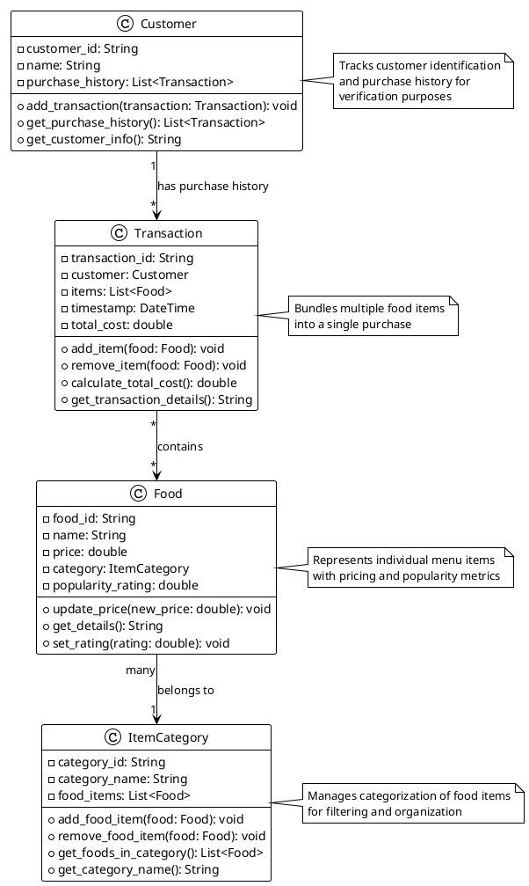

# ByteBites UML Class Diagram

## PlantUML Diagram

## Class Descriptions

### Customer
- **Attributes:**
  - `customer_id`: Unique identifier for each customer
  - `name`: Customer's name
  - `purchase_history`: Collection of all transactions associated with this customer

- **Methods:**
  - `add_transaction(transaction)`: Adds a new transaction to the customer's purchase history
  - `get_purchase_history()`: Returns all transactions for the customer
  - `get_customer_info()`: Returns customer details as a formatted string

### Food
- **Attributes:**
  - `food_id`: Unique identifier for each menu item
  - `name`: Name of the food item (e.g., "Spicy Burger", "Large Soda")
  - `price`: Cost of the item
  - `category`: Reference to the ItemCategory this food belongs to
  - `popularity_rating`: Rating indicating how popular the item is

- **Methods:**
  - `update_price(new_price)`: Updates the price of the food item
  - `get_details()`: Returns formatted food item information
  - `set_rating(rating)`: Updates the popularity rating

### ItemCategory
- **Attributes:**
  - `category_id`: Unique identifier for the category
  - `category_name`: Name of the category (e.g., "Drinks", "Desserts", "Entrees")
  - `food_items`: List of all Food items in this category

- **Methods:**
  - `add_food_item(food)`: Adds a food item to the category
  - `remove_food_item(food)`: Removes a food item from the category
  - `get_foods_in_category()`: Returns all items in this category
  - `get_category_name()`: Returns the category name

### Transaction
- **Attributes:**
  - `transaction_id`: Unique identifier for the transaction
  - `customer`: Reference to the Customer making the purchase
  - `items`: Collection of Food items in this transaction
  - `timestamp`: Date and time of the transaction
  - `total_cost`: Computed total cost of all items

- **Methods:**
  - `add_item(food)`: Adds a food item to the transaction
  - `remove_item(food)`: Removes a food item from the transaction
  - `calculate_total_cost()`: Computes and returns the total cost of all items
  - `get_transaction_details()`: Returns formatted transaction information

## Relationships

1. **Customer ↔ Transaction** (1 to Many)
   - One customer can have multiple transactions
   - Each transaction belongs to exactly one customer
   - Represents purchase history

2. **Transaction ↔ Food** (Many to Many)
   - One transaction contains multiple food items
   - One food item can appear in multiple transactions
   - Represents the items purchased in each transaction

3. **Food ↔ ItemCategory** (Many to One)
   - Many food items belong to one category
   - One category contains many food items
   - Enables filtering by category (e.g., "Drinks", "Desserts")
